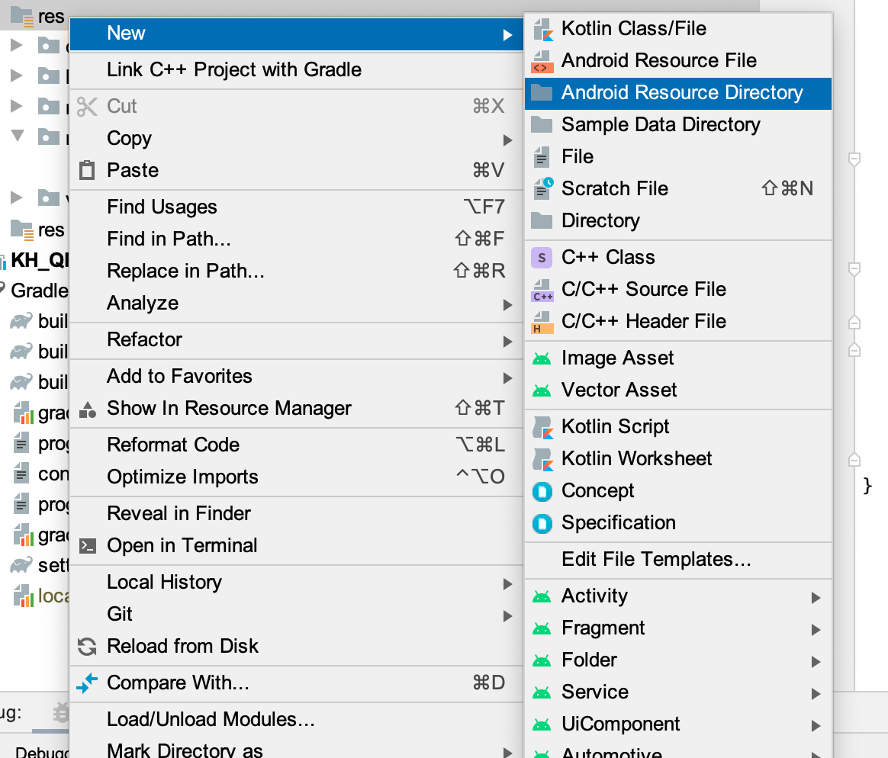

## QRPAYMENT  

QRPayment is an Java library for Android to generate QRcode in accordance to EMVco standard as well as KH QRcode standard.
  
<!-- TABLE OF CONTENTS -->
<details open="open">
  <summary>Table of Contents</summary>
  <ol>
    <li><a href="#installation">Installation</a></li>
    <li><a href="#function">Function</a>
      <ul>
        <li><a href="#setpayment">setPayment()</a></li>
        <li><a href="#generatetext">generateText()</a></li>
        <li><a href="#generateimage">generateImage()</a></li>
        <li><a href="#setfilepath">setFilePath()</a></li>
      </ul>
    </li>
  </ol>
</details>

## Installation

**Step 1** Add the JitPack repository to your build file

Add it in your root build.gradle at the end of repositories:

```
	allprojects {
		repositories {
			...
			maven { url 'https://jitpack.io' }
		}
	}
```

**Step 2** Add the dependency

```
	dependencies {
	        implementation 'com.github.Senior-Code:QRPayment:0.0.2'
	}
```

## Function

### SetPayment 

  **setPayment()** this function is used to set payment to the code.
  * ***parameters:*** *acquirerID*, *mercahntID*, *categoryCode*, *currencyCode*, *transactionAmount*, *identityCode*, *customerNumber*, *merchantName*, *merchantCity*
  
  ```java
  import com.emv.qrpayment.encoder.QRPayment;

  // call QRPayment library
  QRPayment qrpayment = new QRPayment;
  // set value to your QRcode using setPayment()
  qrpayment.setPayment(
      acquirerID: acquirerID, 
      merchantID: merchantID, 
      categoryCode: categoryCode, 
      currencyCode: currencyCode, 
      transactionAmount: TotalAmount, 
      identityCode: billNumber, 
      customerNumber: customerNumber, 
      merchantName: merchantName, 
      merchantCity: MerchantCity);
  qrayment.generateText(); // generate your setPayment as text in EMVco standard
  qrpayment.generateImage(imageview: ImageView, emvcode: emvcode, width: width, height: height); //generate QR code image

  ```
  
### GenerateText
  
**generateText()** generateText() is used to generate QR code as EMVco text format.
* this function is automatically generated from **setPayment()**

```java
  import com.emv.qrpayment.encoder.QRPayment;

  QRPayment qrpayment = new QRPayment;
  qrpayment.setPayment(
      acquirerID: acquirerID, 
      merchantID: merchantID, 
      categoryCode: categoryCode, 
      currencyCode: currencyCode, 
      transactionAmount: TotalAmount, 
      identityCode: billNumber, 
      customerNumber: customerNumber, 
      merchantName: merchantName, 
      merchantCity: MerchantCity);
  String emv = qr.payment.generateText() //output EMVco code as String
  ```
  
### GenerateImage
  
**generateImage()** is used to generate QR code as QR image.
* You need to pass some parameters such as *ImageView*, *EMVcode*, *Width*, *Height* into the function.
* *EMVcode* is the String text which is generated from **generateText()**. You can put the text in another String and call the String in *EMVcode* parameters.
  
  ```java
  import com.emv.qrpayment.encoder.QRPayment;

  QRPayment qrpayment = new QRPayment;
  String emvcode = qrpayment.generateText();
  // set this function to your ImageView to display QR Code
  qrpayment.generateImage( 
      imageview: ImageView, //assign your ImageView to here
      emvcode: emvcode, //String EMV code that generate from generateText()
      width: width, // set your QR image width and height
      height: height); 
  ```
  
### SetFilePath
  
**setFilePath()** is used to give fee condition to your QR code and EMV code.
* You need to download [configfee.csv](https://mega.nz/file/dQ8BDIKY#b7FDQu2eRI5qGFMvM1kd_HZ2iQHEWpssY7Q6agp0YTk) into your project resources directory and call InputStream method to pass the csv file into **setFilePath()**.
  * In your android project directory, you need to create a new Android Resources Directory and put its Resource type to raw.
  
  <p align="center" >        </p>
  
  
  * After you download the file, simply paste the file into res/raw/ in your project directory.
  
  <p align="center" >  </p>
  
  * To pass the file to FilePath, simply create an InputStream to read the file from resource folder and pass the InputStream parameters to **setFilePath()** 
  
    ```java
    import com.emv.qrpayment.encoder.QRPayment;
  
    QRPayment qrpayment = new QRPayment;
    InputStream inputStream = getresources.openRawResource(R.raw.configfee); //config fee is file name
    val inputStream: InputStream = resources.openRawResource(R.raw.configfee) // for Kotlin code
    qrpayment.setFilePath(inputStream);
    ```
  

